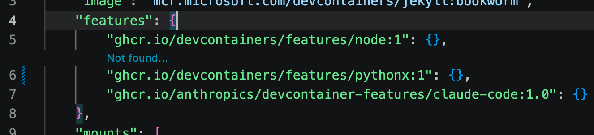

Here's something that might bite you when trying to get Dev Containers working inside of VS Code on macOS 26.  Loading the image will probably work fine, but as soon as you try to add additional features to the devcontainer.json you will start getting SSL errors.

One symptom that you will see is that VS Code will display "Not found..." above the line where you are trying to add the new features entry.  Here I am demonstrating this error by putting the wrong label for `ghcr.io/devcontainers/features/python`:



Another symptom will be seen if you forge ahead and try to rebuild the devcontainer after modifying the JSON file.  In this example, I'm trying to install `ghcr.io/anthropics/devcontainer-features/claude-code`.

```
* Processing feature: ghcr.io/anthropics/devcontainer-features/claude-code:1.0
Loading 29 extra certificates from
    /var/folders/cp/1wcp5mg929nbh0gl917cz6bh0000gn/T/vsch/certificates-fe520313cc9ed9b2d230be837320eccab23a7a9a21806af62f2558dd410386cc.pem.
Error: unable to get issuer certificate
    at TLSSocket.onConnectSecure (node:_tls_wrap:1697:34)
    at TLSSocket.emit (node:events:519:28)
    at TLSSocket._finishInit (node:_tls_wrap:1095:8)
    at ssl.onhandshakedone (node:_tls_wrap:881:12)
Stop (309 ms): Run: /Applications/Visual Studio Code.app/Contents/Frameworks/Code Helper (Plugin).app/Contents/MacOS/Code Helper (Plugin)
    ~/.vscode/extensions/ms-vscode-remote.remote-containers-0.447.0/dist/spec-node/devContainersSpecCLI.js up
    --user-data-folder ~/Library/Application Support/Code/User/globalStorage/ms-vscode-remote.remote-containers/data
    --container-session-data-folder /tmp/devcontainers-76e7e5e8-33e1-42a4-af53-9812e7575de61776005876783
    --workspace-folder ~/blog
    --workspace-mount-consistency cached
    --gpu-availability detect
    --id-label devcontainer.local_folder=~/blog
    --id-label devcontainer.config_file=~/blog/.devcontainer/devcontainer.json
    --log-level debug
    --log-format json
    --config ~/blog/.devcontainer/devcontainer.json
    --default-user-env-probe loginInteractiveShell
    --mount type=volume,source=vscode,target=/vscode,external=true
    --skip-post-create
    --update-remote-user-uid-default on
    --mount-workspace-git-root
    --include-configuration
    --include-merged-configuration
Exit code 1
```

Qwen (the local LLM) was asking whether I'm behind a corporate proxy or other software like Zscaler which adds a non-standard SSL certificate to the connection.  It's a good guess, but I'm not behind such a proxy / intercept.

On another run I got errors like:

```
[55476 ms] [2026-04-12T14:10:00.830Z] @devcontainers/cli 0.83.3. Node.js v22.22.1. darwin 25.4.0 arm64.
[55478 ms] [2026-04-12T14:10:00.832Z] Loading 29 extra certificates from /var/folders/cp/1wcp5mg929nbh0gl917cz6bh0000gn/T/vsch/cert
ificates-fe520313cc9ed9b2d230be837320eccab23a7a9a21806af62f2558dd410386cc.pem.
[55589 ms] Error: unable to get issuer certificate
[55590 ms]     at TLSSocket.onConnectSecure (node:_tls_wrap:1697:34)
[55590 ms]     at TLSSocket.emit (node:events:519:28)
[55590 ms]     at TLSSocket._finishInit (node:_tls_wrap:1095:8)
[55590 ms]     at ssl.onhandshakedone (node:_tls_wrap:881:12) {
[55590 ms]   code: 'UNABLE_TO_GET_ISSUER_CERT'
```

If you run tests, both in the host and inside the devcontainer, with `openssl` and `curl` then nothing wrong will be seen.  That's a strong clue.  If `openssl` and `curl` tests indicate success then you need to look at what is actually doing the install of those features.

Qwen was unable to help me, mostly because it can't search the web when running behind Claude Code (HTTP 422 errors).  I had to do my own web searches to find the solution.

The secret is that on macOS, NPM is struggling.  One or both of the following lines had to be added to my `~/.zshrc` file:

```
export NODE_EXTRA_CA_CERTS=/etc/ssl/cert.pem
export SSL_CERT_FILE=/etc/ssl/cert.pem
```

The SSL errors went away once I added those and restarted Visual Studio Code.